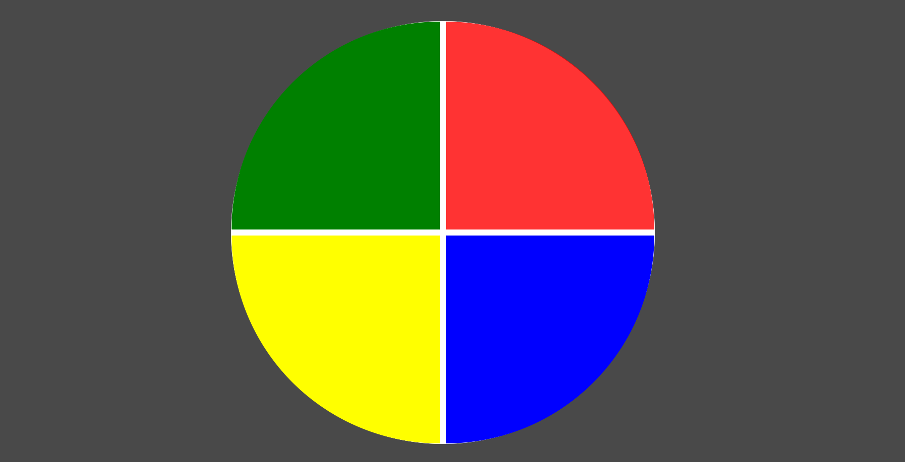

# 💫 Genius

📌 Repositório de aula de Javascript, na qual é desenvolvido um simples jogo Gênius com apenas algumas linhas de código.  
Aula ministrada pela especialista [Gabriela Pinheiro](https://github.com/SpruceGabriela).

  

### 🛠️ Ferramentas 

* [HTML básico](https://www.w3schools.com/html/)
* [CSS básico](https://developer.mozilla.org/pt-BR/docs/Web/CSS)
* [Javascript básico](https://developer.mozilla.org/pt-BR/docs/Web/JavaScript)
 

⚪ Estudo concluído em 15/01/2022
